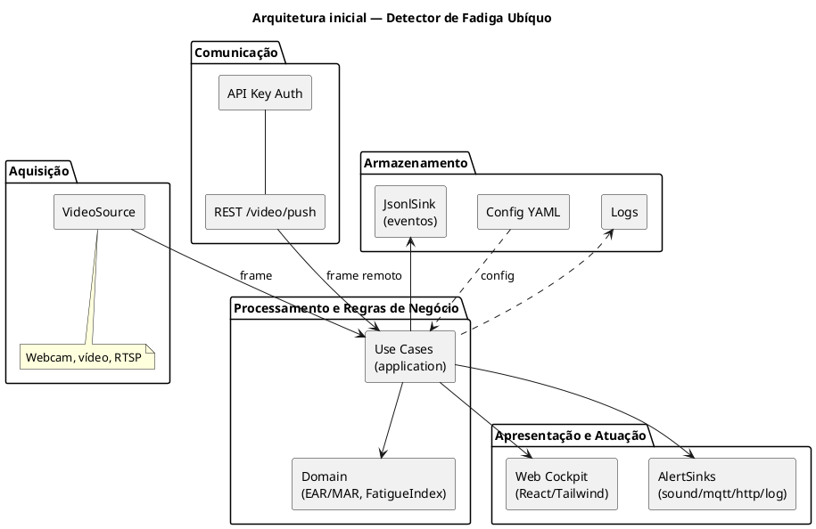
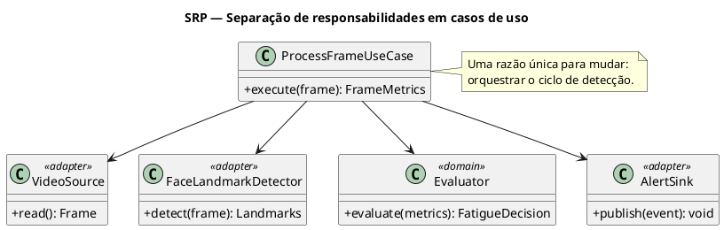
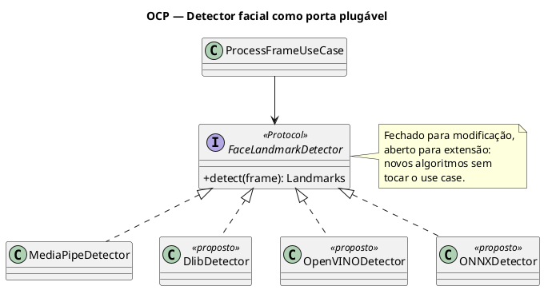
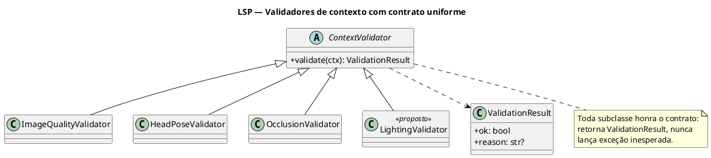
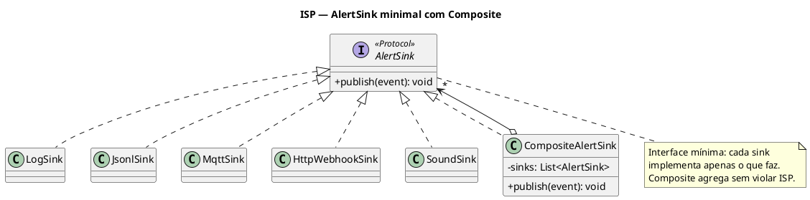
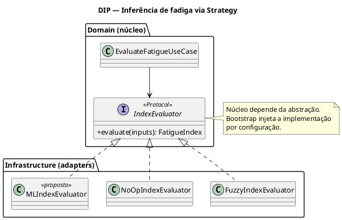
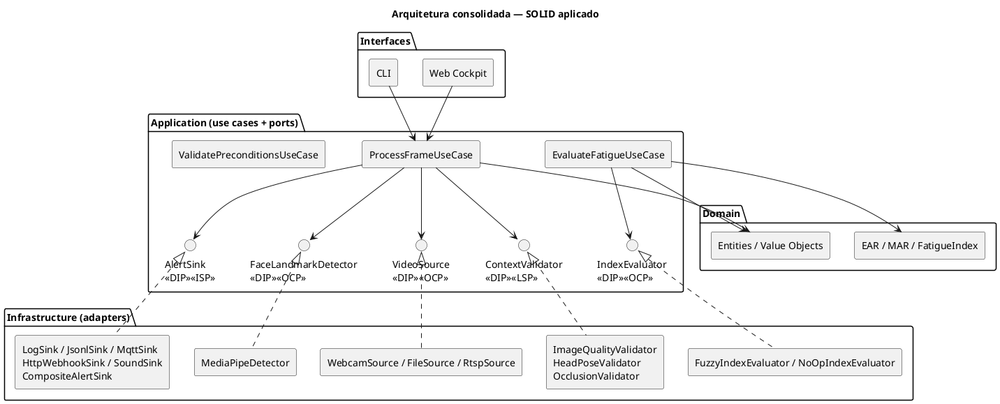

# Artigo SOLID e Sistemas Ubíquos — Implementation Plan

> **For agentic workers:** REQUIRED SUB-SKILL: Use superpowers:subagent-driven-development (recommended) or superpowers:executing-plans to implement this plan task-by-task. Steps use checkbox (`- [ ]`) syntax for tracking.

**Goal:** Produzir o artigo técnico-científico (PDF, formato SBC, ≤6 páginas) sobre aplicação de SOLID à arquitetura do detector de fadiga, com 7 diagramas PlantUML, atendendo às 4 partes da atividade da disciplina de Arquitetura de Software.

**Architecture:** Workflow de produção de artigo acadêmico — 7 diagramas PlantUML versionados como `.puml` → renderizados em PNG via `plantuml.jar` → embutidos em documento LaTeX único (`artigo.tex`) com estrutura SBC. Compilação via Overleaf (toolchain mínimo no host: Java para PlantUML).

**Tech Stack:** LaTeX (estilo SBC), PlantUML, Java (runtime), Bash (scripts de render).

**Spec base:** `docs/superpowers/specs/2026-05-19-artigo-solid-arquitetura-design.md`

---

## File Structure

```
docs/article-solid/
├── artigo.tex                                    # documento LaTeX único
├── sbc-template.sty                              # estilo SBC (baixado)
├── README.md                                     # instruções de compilação
├── tools/
│   ├── plantuml.jar                              # CLI PlantUML
│   └── render-diagrams.sh                        # script de render para PNG
├── diagrams/
│   ├── 01-componentes-inicial.puml
│   ├── 02-srp-use-cases.puml
│   ├── 03-ocp-detector.puml
│   ├── 04-lsp-validators.puml
│   ├── 05-isp-alert-sinks.puml
│   ├── 06-dip-index-evaluator.puml
│   ├── 07-arquitetura-consolidada.puml
│   └── png/                                      # PNGs gerados (versionados)
│       ├── 01-componentes-inicial.png
│       ├── 02-srp-use-cases.png
│       ├── 03-ocp-detector.png
│       ├── 04-lsp-validators.png
│       ├── 05-isp-alert-sinks.png
│       ├── 06-dip-index-evaluator.png
│       └── 07-arquitetura-consolidada.png
```

Single file responsibility: cada `.puml` representa um aspecto arquitetural específico, cada seção de `artigo.tex` cobre uma parte da atividade.

---

## Premissas e dependências externas

- **Java JDK** já instalado no host (`java` no PATH).
- **Overleaf** ou instalação local de LaTeX (TeXLive/MikTeX) para compilação final do PDF — o plano produz `.tex` válido mas não compila o PDF aqui.
- **Acesso à internet** para baixar `plantuml.jar` e o template SBC.
- **`docs/` está em `.gitignore`**, então todos os `git add` precisam de `-f`.

---

## Tarefa 1: Estrutura de pastas

**Files:**
- Create: `docs/article-solid/`, `docs/article-solid/tools/`, `docs/article-solid/diagrams/`, `docs/article-solid/diagrams/png/`

- [ ] **Step 1.1: Criar a estrutura de pastas**

```bash
mkdir -p docs/article-solid/tools docs/article-solid/diagrams/png
```

- [ ] **Step 1.2: Verificar criação**

```bash
ls -la docs/article-solid/
```

Expected: três pastas (`tools/`, `diagrams/`, vazio fora isso).

---

## Tarefa 2: Baixar plantuml.jar

**Files:**
- Create: `docs/article-solid/tools/plantuml.jar`

- [ ] **Step 2.1: Baixar a release oficial mais recente do PlantUML**

```bash
curl -L -o docs/article-solid/tools/plantuml.jar \
  https://github.com/plantuml/plantuml/releases/latest/download/plantuml.jar
```

- [ ] **Step 2.2: Verificar que o JAR funciona**

```bash
java -jar docs/article-solid/tools/plantuml.jar -version
```

Expected: imprime versão (algo como `PlantUML version 1.2024.x...`).

---

## Tarefa 3: Script de render dos diagramas

**Files:**
- Create: `docs/article-solid/tools/render-diagrams.sh`

- [ ] **Step 3.1: Criar o script**

Conteúdo de `docs/article-solid/tools/render-diagrams.sh`:

```bash
#!/usr/bin/env bash
# Renderiza todos os .puml em diagrams/ para PNG em diagrams/png/
set -euo pipefail

SCRIPT_DIR="$(cd "$(dirname "${BASH_SOURCE[0]}")" && pwd)"
ARTICLE_DIR="$(cd "$SCRIPT_DIR/.." && pwd)"
JAR="$SCRIPT_DIR/plantuml.jar"
SRC_DIR="$ARTICLE_DIR/diagrams"
OUT_DIR="$SRC_DIR/png"

mkdir -p "$OUT_DIR"

for puml in "$SRC_DIR"/*.puml; do
  [ -e "$puml" ] || continue
  echo "Rendering: $puml"
  java -jar "$JAR" -tpng -o "$OUT_DIR" "$puml"
done

echo "Done. PNGs em: $OUT_DIR"
```

- [ ] **Step 3.2: Tornar executável (em ambiente bash)**

```bash
chmod +x docs/article-solid/tools/render-diagrams.sh
```

- [ ] **Step 3.3: Commit**

```bash
git add -f docs/article-solid/tools/render-diagrams.sh docs/article-solid/tools/plantuml.jar
git commit -m "chore(artigo-solid): toolchain PlantUML (jar + render script)"
```

---

## Tarefa 4: SBC template (.sty)

O template SBC oficial está disponível em `www.sbc.org.br` (em "Eventos > Templates de artigos"). É um pacote ZIP com `sbc-template.sty` + `sbc-template.cls` + arquivos auxiliares.

**Files:**
- Create: `docs/article-solid/sbc-template.sty` (e quaisquer dependências do pacote, como `sbcconf.sty`)

- [ ] **Step 4.1: Baixar template SBC**

Opções, em ordem de preferência:

1. **Se o grupo já tem o template do artigo anterior:** copiar `sbc-template.sty` (e `sbcconf.sty` se existir) para `docs/article-solid/`.
2. **Senão:** baixar do site da SBC. Como o link exato muda, executar manualmente:

```bash
# Exemplo (URL pode mudar — confirmar com o grupo):
curl -L -o /tmp/sbc-template.zip \
  "http://www.sbc.org.br/documentos-da-sbc/category/169-templates-para-artigos-e-capitulos-de-livros"
# Descompactar e copiar .sty para docs/article-solid/
```

3. **Fallback (Overleaf):** o Overleaf hospeda o template SBC em template gallery. Criar projeto a partir dele e baixar o `.sty` localmente.

- [ ] **Step 4.2: Verificar presença**

```bash
ls docs/article-solid/sbc-template.sty
```

Expected: arquivo presente, >5KB.

- [ ] **Step 4.3: Commit**

```bash
git add -f docs/article-solid/sbc-template.sty
git commit -m "chore(artigo-solid): adiciona estilo SBC"
```

---

## Tarefa 5: Diagrama 01 — Componentes inicial (Parte I)

**Files:**
- Create: `docs/article-solid/diagrams/01-componentes-inicial.puml`
- Generate: `docs/article-solid/diagrams/png/01-componentes-inicial.png`

- [ ] **Step 5.1: Escrever o diagrama**

Conteúdo de `docs/article-solid/diagrams/01-componentes-inicial.puml`:



- [ ] **Step 5.2: Renderizar**

```bash
java -jar docs/article-solid/tools/plantuml.jar -tpng \
  -o docs/article-solid/diagrams/png \
  docs/article-solid/diagrams/01-componentes-inicial.puml
```

- [ ] **Step 5.3: Verificar PNG gerado**

```bash
ls -la docs/article-solid/diagrams/png/01-componentes-inicial.png
```

Expected: arquivo presente, >10KB.

- [ ] **Step 5.4: Commit**

```bash
git add -f docs/article-solid/diagrams/01-componentes-inicial.puml \
  docs/article-solid/diagrams/png/01-componentes-inicial.png
git commit -m "feat(artigo-solid): diagrama 01 - componentes inicial"
```

---

## Tarefa 6: Diagrama 02 — SRP / Use Cases

**Files:**
- Create: `docs/article-solid/diagrams/02-srp-use-cases.puml`
- Generate: `docs/article-solid/diagrams/png/02-srp-use-cases.png`

- [ ] **Step 6.1: Escrever o diagrama**

Conteúdo de `docs/article-solid/diagrams/02-srp-use-cases.puml`:



- [ ] **Step 6.2: Renderizar**

```bash
java -jar docs/article-solid/tools/plantuml.jar -tpng \
  -o docs/article-solid/diagrams/png \
  docs/article-solid/diagrams/02-srp-use-cases.puml
```

- [ ] **Step 6.3: Commit**

```bash
git add -f docs/article-solid/diagrams/02-srp-use-cases.puml \
  docs/article-solid/diagrams/png/02-srp-use-cases.png
git commit -m "feat(artigo-solid): diagrama 02 - SRP use cases"
```

---

## Tarefa 7: Diagrama 03 — OCP / Detector

**Files:**
- Create: `docs/article-solid/diagrams/03-ocp-detector.puml`
- Generate: `docs/article-solid/diagrams/png/03-ocp-detector.png`

- [ ] **Step 7.1: Escrever o diagrama**

Conteúdo de `docs/article-solid/diagrams/03-ocp-detector.puml`:



- [ ] **Step 7.2: Renderizar e commitar**

```bash
java -jar docs/article-solid/tools/plantuml.jar -tpng \
  -o docs/article-solid/diagrams/png \
  docs/article-solid/diagrams/03-ocp-detector.puml
git add -f docs/article-solid/diagrams/03-ocp-detector.puml \
  docs/article-solid/diagrams/png/03-ocp-detector.png
git commit -m "feat(artigo-solid): diagrama 03 - OCP detector"
```

---

## Tarefa 8: Diagrama 04 — LSP / Validators

**Files:**
- Create: `docs/article-solid/diagrams/04-lsp-validators.puml`
- Generate: `docs/article-solid/diagrams/png/04-lsp-validators.png`

- [ ] **Step 8.1: Escrever o diagrama**

Conteúdo de `docs/article-solid/diagrams/04-lsp-validators.puml`:



- [ ] **Step 8.2: Renderizar e commitar**

```bash
java -jar docs/article-solid/tools/plantuml.jar -tpng \
  -o docs/article-solid/diagrams/png \
  docs/article-solid/diagrams/04-lsp-validators.puml
git add -f docs/article-solid/diagrams/04-lsp-validators.puml \
  docs/article-solid/diagrams/png/04-lsp-validators.png
git commit -m "feat(artigo-solid): diagrama 04 - LSP validators"
```

---

## Tarefa 9: Diagrama 05 — ISP / Alert Sinks

**Files:**
- Create: `docs/article-solid/diagrams/05-isp-alert-sinks.puml`
- Generate: `docs/article-solid/diagrams/png/05-isp-alert-sinks.png`

- [ ] **Step 9.1: Escrever o diagrama**

Conteúdo de `docs/article-solid/diagrams/05-isp-alert-sinks.puml`:



- [ ] **Step 9.2: Renderizar e commitar**

```bash
java -jar docs/article-solid/tools/plantuml.jar -tpng \
  -o docs/article-solid/diagrams/png \
  docs/article-solid/diagrams/05-isp-alert-sinks.puml
git add -f docs/article-solid/diagrams/05-isp-alert-sinks.puml \
  docs/article-solid/diagrams/png/05-isp-alert-sinks.png
git commit -m "feat(artigo-solid): diagrama 05 - ISP alert sinks"
```

---

## Tarefa 10: Diagrama 06 — DIP / Index Evaluator

**Files:**
- Create: `docs/article-solid/diagrams/06-dip-index-evaluator.puml`
- Generate: `docs/article-solid/diagrams/png/06-dip-index-evaluator.png`

- [ ] **Step 10.1: Escrever o diagrama**

Conteúdo de `docs/article-solid/diagrams/06-dip-index-evaluator.puml`:



- [ ] **Step 10.2: Renderizar e commitar**

```bash
java -jar docs/article-solid/tools/plantuml.jar -tpng \
  -o docs/article-solid/diagrams/png \
  docs/article-solid/diagrams/06-dip-index-evaluator.puml
git add -f docs/article-solid/diagrams/06-dip-index-evaluator.puml \
  docs/article-solid/diagrams/png/06-dip-index-evaluator.png
git commit -m "feat(artigo-solid): diagrama 06 - DIP index evaluator"
```

---

## Tarefa 11: Diagrama 07 — Arquitetura consolidada

**Files:**
- Create: `docs/article-solid/diagrams/07-arquitetura-consolidada.puml`
- Generate: `docs/article-solid/diagrams/png/07-arquitetura-consolidada.png`

- [ ] **Step 11.1: Escrever o diagrama**

Conteúdo de `docs/article-solid/diagrams/07-arquitetura-consolidada.puml`:



- [ ] **Step 11.2: Renderizar e commitar**

```bash
java -jar docs/article-solid/tools/plantuml.jar -tpng \
  -o docs/article-solid/diagrams/png \
  docs/article-solid/diagrams/07-arquitetura-consolidada.puml
git add -f docs/article-solid/diagrams/07-arquitetura-consolidada.puml \
  docs/article-solid/diagrams/png/07-arquitetura-consolidada.png
git commit -m "feat(artigo-solid): diagrama 07 - arquitetura consolidada"
```

---

## Tarefa 12: `artigo.tex` — preâmbulo, título, autores, resumos

**Files:**
- Create: `docs/article-solid/artigo.tex`

- [ ] **Step 12.1: Criar o esqueleto LaTeX com preâmbulo + título + autores + abstract + resumo + palavras-chave**

Conteúdo inicial de `docs/article-solid/artigo.tex`:

```latex
\documentclass[12pt]{article}

\usepackage{placeins}
\usepackage{amsmath}
\usepackage{listings}
\usepackage{sbc-template}
\usepackage{graphicx,url}
\usepackage{booktabs}
\lstset{
    breaklines=false,
    basicstyle=\ttfamily\small,
    columns=fullflexible
}
\usepackage[brazil]{babel}
\sloppy

\title{Aplicação dos Princípios SOLID na Arquitetura de\\ um Detector de Fadiga Ubíquo}

\author{Julliely S. Silva\inst{1}, Luis Eduardo S. Teles\inst{1}, Luis Felipe H. Penariol\inst{1},\\
Flávio Filho\inst{1}, Fellipe T.\inst{1}, Lucas Moraes\inst{1}}

\address{Instituto Federal de Goiás -- Câmpus Inhumas (IFG)\\
Bacharelado em Engenharia de Software -- Inhumas, GO -- Brasil
\email{julliely.sousa@gmail.com, luixst1@gmail.com, luisohernandez27@gmail.com,
engenheiro.flaviofilho@gmail.com, Fellipet03@gmail.com, lucaogmoraes@gmail.com}
}

\begin{document}

\maketitle

\begin{abstract}
This paper applies the five SOLID principles to the architecture of a real-time driver fatigue detection system, a ubiquitous application that combines computer vision, contextual validation and multimodal fusion. Starting from a monolithic baseline, we identify five architectural sensitive points whose evolution risks violating SOLID, and present a refactored Clean Architecture organized in domain, application, infrastructure and interface layers. Each principle is anchored in a concrete aspect of the system — face landmark detection, context validators, fatigue inference strategy and pluggable alert sinks. We consolidate the design through three Architecture Decision Records and discuss the limits of applying SOLID to resource-constrained ubiquitous devices.
\end{abstract}

\begin{resumo}
Este artigo aplica os cinco princípios SOLID à arquitetura de um sistema de detecção de fadiga em motoristas em tempo real, uma aplicação ubíqua que combina visão computacional, validação contextual e fusão multimodal. Partindo de uma versão monolítica como linha de base, identificamos cinco pontos arquiteturais sensíveis cuja evolução tende a violar SOLID, e apresentamos uma refatoração em Clean Architecture organizada em camadas de domínio, aplicação, infraestrutura e interfaces. Cada princípio é ancorado em um aspecto concreto do sistema — detecção de marcos faciais, validadores de contexto, estratégia de inferência de fadiga e saídas de alerta plugáveis. Consolidamos o desenho por meio de três Architecture Decision Records e discutimos os limites de aplicar SOLID em dispositivos ubíquos com restrição de recursos.
\end{resumo}

\noindent \textbf{Palavras-chave:} SOLID, sistemas ubíquos, arquitetura de software, Clean Architecture, detecção de fadiga, ADR.

% --- Seções do artigo vão aqui (Tarefas 13–19) ---

\end{document}
```

- [ ] **Step 12.2: Commit**

```bash
git add -f docs/article-solid/artigo.tex
git commit -m "feat(artigo-solid): esqueleto LaTeX com titulo, autores e resumos"
```

**Nota sobre autores:** os nomes dos 3 últimos coautores (Flávio Filho, Fellipe T., Lucas Moraes) são inferidos dos e-mails. Confirmar com cada coautor e ajustar grafia antes da submissão.

---

## Tarefa 13: Seção 1 — Introdução

**Files:**
- Modify: `docs/article-solid/artigo.tex` (inserir antes do `\end{document}`)

- [ ] **Step 13.1: Inserir a Seção 1**

Substituir o comentário `% --- Seções do artigo vão aqui ---` por:

```latex
\section{Introdução}

Sistemas ubíquos caracterizam-se por integrar discretamente computação ao ambiente, combinando dispositivos heterogêneos, sensibilidade ao contexto e atuação transparente para o usuário. A detecção de fadiga em motoristas é um exemplo canônico: uma câmera embarcada captura o rosto do condutor, algoritmos de visão computacional inferem indicadores como Eye Aspect Ratio (EAR) e Mouth Aspect Ratio (MAR), e atuadores físicos ou digitais alertam o condutor quando há risco de sonolência. Como toda aplicação ubíqua, o sistema precisa evoluir para acomodar novos sensores, novos algoritmos e novos canais de notificação sem comprometer o núcleo.

Em um trabalho anterior, propusemos uma versão monolítica do detector em Python, integrando OpenCV, Dlib e Pygame em um único script de captura e decisão. Embora funcional, essa versão acumulava responsabilidades, codificava limiares fixos no laço principal e acoplava algoritmos específicos a dispositivos físicos. Tais decisões dificultavam a evolução para novos algoritmos de detecção, novas estratégias de inferência de fadiga e novos meios de atuação --- características esperadas em qualquer sistema ubíquo realista.

Este artigo apresenta a refatoração arquitetural desse detector segundo os cinco princípios SOLID, aplicados a aspectos concretos do sistema. O objetivo é triplo: \textit{(i)} diagnosticar pontos arquiteturais sensíveis a violações de SOLID; \textit{(ii)} aplicar cada princípio a um aspecto específico do detector, mostrando o contraste antes/depois e justificando cada decisão em termos de característica ubíqua; e \textit{(iii)} consolidar o desenho em uma arquitetura integrada documentada por meio de Architecture Decision Records. A Seção~2 sintetiza a fundamentação teórica. A Seção~3 apresenta o diagnóstico arquitetural. A Seção~4 aplica os cinco princípios. A Seção~5 consolida o desenho. As Seções~6 e~7 discutem os limites da abordagem e concluem o trabalho.
```

- [ ] **Step 13.2: Commit**

```bash
git add -f docs/article-solid/artigo.tex
git commit -m "feat(artigo-solid): secao 1 - introducao"
```

---

## Tarefa 14: Seção 2 — Fundamentação teórica

**Files:**
- Modify: `docs/article-solid/artigo.tex`

- [ ] **Step 14.1: Inserir Seção 2 imediatamente após a Seção 1**

```latex
\section{Fundamentação teórica}

\subsection{Sistemas ubíquos}

O conceito de computação ubíqua foi introduzido por \textbf{Weiser (1991)} como uma visão na qual computadores se integram discretamente ao ambiente, deixando de competir pela atenção do usuário. \textbf{Satyanarayanan (2001)} sistematizou os desafios técnicos da pervasive computing, destacando heterogeneidade, mobilidade, sensibilidade ao contexto e adaptação dinâmica. No contexto brasileiro, \textbf{Araujo (2003)} descreve as tecnologias habilitadoras e os principais desafios de pesquisa. As características recorrentes em quaisquer dessas referências --- heterogeneidade de dispositivos, mobilidade computacional, sensibilidade ao contexto, transparência e escalabilidade --- guiam o diagnóstico arquitetural deste trabalho.

\subsection{Princípios SOLID}

Os princípios SOLID, popularizados por \textbf{Martin (2002, 2019)}, são heurísticas de design orientado a objetos voltadas à manutenibilidade e à extensibilidade. SRP defende que uma classe deve ter uma única razão para mudar; OCP, que o código seja aberto para extensão e fechado para modificação; LSP, que subtipos respeitem o contrato de seus supertipos; ISP, que clientes não dependam de métodos que não usam; e DIP, que módulos de alto nível dependam de abstrações, não de detalhes. \textbf{Bass et al.\ (2021)} situam esses princípios no contexto mais amplo de arquitetura de software como decisões de longo prazo, formalizadas por meio de Architecture Decision Records (\textbf{Nygard, 2011}).
```

- [ ] **Step 14.2: Commit**

```bash
git add -f docs/article-solid/artigo.tex
git commit -m "feat(artigo-solid): secao 2 - fundamentacao teorica"
```

---

## Tarefa 15: Seção 3 — Proposta arquitetural (Parte I)

**Files:**
- Modify: `docs/article-solid/artigo.tex`

- [ ] **Step 15.1: Inserir Seção 3 com Fig. 1 e Tabela 1**

```latex
\section{Proposta arquitetural}

O detector de fadiga em sua forma evoluída expõe cinco camadas funcionais, ilustradas na Figura~\ref{fig:componentes-inicial}. A camada de \textit{aquisição} encapsula fontes de vídeo heterogêneas (webcam local, arquivo de vídeo, fluxo RTSP). A camada de \textit{comunicação} expõe um endpoint REST autenticado por chave de API que permite empurrar frames de fontes remotas. A camada de \textit{processamento e regras de negócio} concentra os casos de uso e o domínio (cálculos de EAR/MAR e índice de fadiga). A camada de \textit{armazenamento} persiste eventos em formato JSONL, mantém configuração em YAML e produz logs estruturados. A camada de \textit{apresentação e atuação} reúne uma interface web em React/Tailwind e múltiplos canais de alerta.

\begin{figure}[htbp]
    \centering
    \includegraphics[width=0.95\columnwidth]{diagrams/png/01-componentes-inicial.png}
    \caption{Arquitetura inicial em cinco camadas.}
    \label{fig:componentes-inicial}
\end{figure}
\FloatBarrier

A partir desse mapa, identificamos cinco pontos arquiteturais sensíveis: regiões em que a evolução natural do sistema tende a violar princípios SOLID se nenhuma decisão explícita for tomada. A Tabela~\ref{tab:pontos-sensiveis} apresenta esses pontos, o princípio em risco em cada caso, o sintoma esperado e a característica ubíqua envolvida. Cada ponto é tratado em uma subseção da Seção~4.

\begin{table}[htbp]
\centering
\caption{Pontos arquiteturais sensíveis identificados.}
\label{tab:pontos-sensiveis}
\small
\begin{tabular}{p{3.3cm}lp{4.6cm}p{3.1cm}}
\toprule
\textbf{Ponto sensível} & \textbf{Princípio} & \textbf{Sintoma esperado} & \textbf{Característica ubíqua} \\
\midrule
Loop principal monolítico & SRP & Toda alteração força edição do mesmo arquivo; testes unitários inviáveis & Escalabilidade \\
Detector facial \textit{hard-coded} & OCP & Trocar de algoritmo exige reescrever o pipeline de detecção & Heterogeneidade de algoritmos \\
Validadores de contexto heterogêneos & LSP & Assinaturas divergentes; adicionar validador quebra o orquestrador & Sensibilidade ao contexto \\
Interface ``alerta'' inflada & ISP & Canais silenciosos forçados a implementar métodos de áudio & Heterogeneidade de atuadores \\
Motor de inferência acoplado & DIP & Substituir limiar por fuzzy/ML exige cirurgia no núcleo & Mobilidade computacional \\
\bottomrule
\end{tabular}
\end{table}
```

- [ ] **Step 15.2: Commit**

```bash
git add -f docs/article-solid/artigo.tex
git commit -m "feat(artigo-solid): secao 3 - proposta arquitetural + tabela 1"
```

---

## Tarefa 16: Seção 4 — Aplicação dos princípios SOLID (Parte II)

**Files:**
- Modify: `docs/article-solid/artigo.tex`

- [ ] **Step 16.1: Inserir Seção 4 completa com as 5 subseções e Figs. 2–6**

```latex
\section{Aplicação dos princípios SOLID}

Esta seção aplica cada um dos cinco princípios a um aspecto concreto do detector. Para cada princípio, descrevemos brevemente a solução ingênua (referente à versão monolítica anterior), apresentamos o desenho resultante após aplicação do princípio (referente ao código atual em \texttt{src/driver\_fatigue/}) e justificamos a escolha com base em uma característica ubíqua específica.

\subsection{Single Responsibility Principle (SRP)}

\textbf{Aspecto:} orquestração do ciclo de processamento de fadiga. Na solução ingênua, um único laço em \texttt{main.py} captura o frame, converte cor, invoca \texttt{dlib} para landmarks, calcula EAR/MAR, decide alerta, persiste evento e renderiza a janela --- todas as razões de mudança convergiam para o mesmo arquivo.

\textbf{Desenho com SRP:} a Figura~\ref{fig:srp} mostra a separação em \texttt{ProcessFrameUseCase} (orquestração), \texttt{Evaluator} (decisão), \texttt{VideoSource} (captura), \texttt{FaceLandmarkDetector} (extração) e \texttt{AlertSink} (publicação). Cada classe tem uma razão única para mudar.

\begin{figure}[htbp]
    \centering
    \includegraphics[width=0.85\columnwidth]{diagrams/png/02-srp-use-cases.png}
    \caption{SRP: separação em casos de uso.}
    \label{fig:srp}
\end{figure}
\FloatBarrier

\textbf{Justificativa ubíqua:} \textit{escalabilidade}. Em cenário ubíquo evolutivo (múltiplos motoristas, múltiplas câmeras, frota), separar responsabilidades habilita escalar cada componente independentemente --- a captura pode mover-se para edge devices enquanto a inferência permanece em servidor central.

\subsection{Open/Closed Principle (OCP)}

\textbf{Aspecto:} extensão para novos detectores faciais. Na versão ingênua, \texttt{dlib.get\_frontal\_face\_detector()} e \texttt{shape\_predictor\_68\_face\_landmarks.dat} eram invocados diretamente no laço; trocar para MediaPipe ou OpenVINO exigia reescrever o pipeline.

\textbf{Desenho com OCP:} a Figura~\ref{fig:ocp} apresenta a interface \texttt{FaceLandmarkDetector} como ponto de extensão. A implementação corrente é \texttt{MediaPipeDetector}; novas alternativas (\texttt{DlibDetector}, \texttt{OpenVINODetector}, \texttt{ONNXDetector}) são acrescentadas sem alterar \texttt{ProcessFrameUseCase}.

\begin{figure}[htbp]
    \centering
    \includegraphics[width=0.85\columnwidth]{diagrams/png/03-ocp-detector.png}
    \caption{OCP: detector facial como porta plugável.}
    \label{fig:ocp}
\end{figure}
\FloatBarrier

\textbf{Justificativa ubíqua:} \textit{heterogeneidade de dispositivos e algoritmos}. Sistemas ubíquos rodam em hardware variado --- de laptops a edge devices Intel e smartphones --- e devem permitir a substituição do algoritmo de detecção por configuração, sem reescrever o núcleo.

\subsection{Liskov Substitution Principle (LSP)}

\textbf{Aspecto:} validação de contexto (qualidade de imagem, oclusão, head pose). Na versão ingênua, funções soltas com assinaturas divergentes (umas lançavam exceção, outras retornavam \texttt{None}) misturavam-se ao laço, quebrando o contrato implícito esperado pelo orquestrador.

\textbf{Desenho com LSP:} a Figura~\ref{fig:lsp} apresenta a classe abstrata \texttt{ContextValidator} com método \texttt{validate(ctx) $\to$ ValidationResult}. Todas as subclasses (\texttt{ImageQualityValidator}, \texttt{HeadPose\-Validator}, \texttt{OcclusionValidator}, \texttt{LightingValidator}) honram o contrato: nunca lançam exceções inesperadas e sempre retornam um \texttt{ValidationResult} estruturado, sendo intercambiáveis em qualquer ponto da cadeia de validação.

\begin{figure}[htbp]
    \centering
    \includegraphics[width=0.85\columnwidth]{diagrams/png/04-lsp-validators.png}
    \caption{LSP: validadores com contrato uniforme.}
    \label{fig:lsp}
\end{figure}
\FloatBarrier

\textbf{Justificativa ubíqua:} \textit{sensibilidade ao contexto}. Validadores que violam seu contrato propagam exceções até a UI e quebram a transparência prometida ao motorista --- exatamente a propriedade que se espera de um sistema ubíquo.

\subsection{Interface Segregation Principle (ISP)}

\textbf{Aspecto:} publicação de eventos de fadiga em múltiplos canais. Na versão ingênua, uma única função \texttt{alarm()} acumulava reprodução de som, log e --- ao evoluir --- MQTT e webhook HTTP, forçando sinks ``silenciosos'' (como gravação JSONL) a implementar métodos de áudio que não usam.

\textbf{Desenho com ISP:} a Figura~\ref{fig:isp} apresenta a interface minimal \texttt{AlertSink} com um único método \texttt{publish(event)}. Cinco implementações especializadas (\texttt{LogSink}, \texttt{JsonlSink}, \texttt{MqttSink}, \texttt{HttpWebhookSink}, \texttt{SoundSink}) cada uma com uma única responsabilidade, são agregadas por \texttt{CompositeAlertSink} sem violar o contrato.

\begin{figure}[htbp]
    \centering
    \includegraphics[width=0.85\columnwidth]{diagrams/png/05-isp-alert-sinks.png}
    \caption{ISP: \texttt{AlertSink} minimal com Composite.}
    \label{fig:isp}
\end{figure}
\FloatBarrier

\textbf{Justificativa ubíqua:} \textit{heterogeneidade de atuadores}. Sistemas ubíquos atuam por múltiplos canais físicos e lógicos (som, painel visual, push para nuvem, log local); interfaces segregadas permitem que cada atuador seja exatamente o que precisa ser.

\subsection{Dependency Inversion Principle (DIP)}

\textbf{Aspecto:} motor de inferência de fadiga. Na versão ingênua, a regra ``EAR $< 0{,}25$ por 20 frames consecutivos'' estava embutida no laço, tornando impossível experimentar lógica fuzzy ou modelo neural sem reescrever o núcleo.

\textbf{Desenho com DIP:} a Figura~\ref{fig:dip} apresenta a interface \texttt{IndexEvaluator} no domínio. As implementações concretas (\texttt{FuzzyIndexEvaluator} com 12 regras IF--THEN e \texttt{NoOpIndexEvaluator} como \textit{fallback}) vivem em \texttt{infrastructure/fatigue\_inference/}. O caso de uso depende apenas da abstração; o \textit{bootstrap} injeta a implementação por configuração.

\begin{figure}[htbp]
    \centering
    \includegraphics[width=0.85\columnwidth]{diagrams/png/06-dip-index-evaluator.png}
    \caption{DIP: inferência via Strategy.}
    \label{fig:dip}
\end{figure}
\FloatBarrier

\textbf{Justificativa ubíqua:} \textit{mobilidade computacional}. A mesma decisão de fadiga pode ser tomada no \textit{edge} (laptop do motorista, fuzzy leve) ou na nuvem (modelo ML pesado quando há conectividade); DIP permite mover a lógica entre \textit{tiers} sem reescrever o núcleo.
```

- [ ] **Step 16.2: Commit**

```bash
git add -f docs/article-solid/artigo.tex
git commit -m "feat(artigo-solid): secao 4 - aplicacao SOLID (5 subsecoes)"
```

---

## Tarefa 17: Seção 5 — Arquitetura consolidada + ADRs (Parte III)

**Files:**
- Modify: `docs/article-solid/artigo.tex`

- [ ] **Step 17.1: Inserir Seção 5 com Fig. 7 e Tabela 2**

```latex
\section{Arquitetura consolidada}

A Figura~\ref{fig:consolidada} apresenta o desenho integrado após aplicação dos cinco princípios. As cinco portas (\texttt{FaceLandmarkDetector}, \texttt{VideoSource}, \texttt{ContextValidator}, \texttt{IndexEvaluator}, \texttt{AlertSink}) ficam expostas pela camada de aplicação, demarcadas com estereótipos «DIP», «OCP», «LSP» e «ISP» conforme o princípio dominante em cada uma. Os \textit{adapters} concretos vivem em \texttt{infrastructure/}, e a camada de domínio permanece livre de qualquer detalhe técnico.

\begin{figure}[htbp]
    \centering
    \includegraphics[width=\columnwidth]{diagrams/png/07-arquitetura-consolidada.png}
    \caption{Arquitetura consolidada com pontos de extensão marcados.}
    \label{fig:consolidada}
\end{figure}
\FloatBarrier

A Tabela~\ref{tab:adrs} sintetiza três Architecture Decision Records que registram as decisões arquiteturais mais importantes consolidadas neste desenho, no formato \textbf{Nygard (2011)}.

\begin{table}[htbp]
\centering
\caption{ADRs consolidados.}
\label{tab:adrs}
\small
\begin{tabular}{p{0.9cm}p{6.6cm}p{4.8cm}}
\toprule
\textbf{ADR} & \textbf{Decisão e contexto} & \textbf{Consequências} \\
\midrule
\textbf{01} (Aceito) &
\textbf{Detector facial como porta plugável.} Detector originalmente \texttt{dlib} \textit{hard-coded}; trocar exigia editar o laço principal. Introduzimos \texttt{FaceLandmark\-Detector} como \texttt{Protocol} em \texttt{application/ports.py}; \texttt{MediaPipeDetector} é apenas uma implementação. \textbf{OCP + DIP.} &
$+$ troca de detector por configuração; $+$ teste com \textit{fake}. $-$ um nível de indireção; $-$ \textit{factory} de \textit{bootstrap}. \\
\midrule
\textbf{02} (Aceito) &
\textbf{Inferência via Strategy com fallback NoOp.} Lógica de decisão antes atrelada a limiar fixo. \texttt{IndexEvaluator} no domínio, com \texttt{FuzzyIndexEvaluator} (12 regras) e \texttt{NoOpIndexEvaluator} (\textit{feature flag} desligada). \textbf{DIP + OCP}, LSP implícito. &
$+$ \textit{toggle} por config; $+$ caminho aberto para \texttt{MLIndexEvaluator}. $-$ aumento na superfície de testes; $-$ \texttt{NoOp} precisa permanecer compatível. \\
\midrule
\textbf{03} (Aceito) &
\textbf{AlertSinks segregados via Composite.} Notificação antes misturava som, log e webhooks. Interface minimal \texttt{AlertSink.publish(event)} com cinco \textit{sinks} especializados e \texttt{CompositeAlertSink} agregador. \textbf{ISP + SRP.} &
$+$ adicionar/remover canal sem mexer no núcleo; $+$ falha isolada por \textit{sink}. $-$ muitos arquivos pequenos; $-$ política de falha parcial a definir. \\
\bottomrule
\end{tabular}
\end{table}
```

- [ ] **Step 17.2: Commit**

```bash
git add -f docs/article-solid/artigo.tex
git commit -m "feat(artigo-solid): secao 5 - arquitetura consolidada + ADRs"
```

---

## Tarefa 18: Seção 6 — Discussão (Parte IV)

**Files:**
- Modify: `docs/article-solid/artigo.tex`

- [ ] **Step 18.1: Inserir Seção 6 com as três subseções (4.1, 4.2, 4.3 da atividade)**

```latex
\section{Discussão}

\subsection{Características ubíquas que tornam SOLID relevante}

Duas características ubíquas tornam a aplicação de SOLID particularmente valiosa em nosso sistema. A \textbf{heterogeneidade} é capturada pelo ADR-01: o mesmo detector precisa rodar com \texttt{MediaPipe} em laptop, eventualmente \texttt{OpenVINO} em \textit{edge devices} Intel e \texttt{ONNX} em servidor com GPU; sem OCP+DIP, cada novo destino exigiria um \textit{fork} do pipeline. A \textbf{sensibilidade ao contexto} aparece nos validadores (LSP) e na inferência fuzzy (DIP): o sistema adapta-se a luz ambiente, oclusão por óculos e ângulo de cabeça, e a estratégia de decisão pode mudar conforme o cenário (modo noturno empregando modelo diferente do diurno).

\subsection{Onde SOLID pode ser contraproducente}

O \textit{hot path} de captura e pré-processamento de frame --- \texttt{VideoSource.read()} seguido de conversão de cor e \texttt{Detector.detect\_landmarks()} --- roda a 30 quadros por segundo, e cada microssegundo conta. Aplicar Strategy, Visitor ou Chain-of-Responsibility neste trecho introduziria \textit{overhead} de invocação virtual e perda de localidade de \textit{cache} que poderiam baixar o FPS efetivo. Justifica-se manter este trecho linear e acoplado dentro do \textit{adapter} concreto (\texttt{MediaPipeDetector.detect}), com SOLID concentrado apenas na \textbf{fronteira} entre detector e caso de uso --- não dentro dele.

\subsection{SOLID em dispositivos restritos: postura do grupo}

O detector, em sua forma atual, roda em laptop ou desktop, mas a aplicação ubíqua natural envolveria portar o sistema para hardware embarcado (\texttt{ESP32-CAM}, \texttt{Raspberry Pi Zero}). Defendemos uma postura de \textbf{aplicação parcial e por camada}: nas camadas superiores --- domínio, aplicação, portas --- SOLID se aplica plenamente, pois envolve poucos objetos, mudanças pouco frequentes em \textit{runtime} e ganho claro em testabilidade. Na camada de \textit{edge}, em contraste, SOLID se aplica apenas na \textbf{fronteira} (uma porta única para o caso de uso); internamente, o \textit{adapter} pode ser procedural, com \textit{buffers} pré-alocados e zero indireção, otimizado para o \textit{hardware} específico. Essa postura evita o dogmatismo de ``SOLID em tudo'' e respeita a realidade de que sistemas ubíquos têm camadas com perfis de recursos radicalmente diferentes.
```

- [ ] **Step 18.2: Commit**

```bash
git add -f docs/article-solid/artigo.tex
git commit -m "feat(artigo-solid): secao 6 - discussao critica"
```

---

## Tarefa 19: Seção 7 — Considerações finais + Referências

**Files:**
- Modify: `docs/article-solid/artigo.tex`

- [ ] **Step 19.1: Inserir Seção 7 e a seção de Referências**

```latex
\section{Considerações finais}

A aplicação dos cinco princípios SOLID à arquitetura do detector de fadiga rendeu três efeitos práticos: a separação clara entre domínio e infraestrutura permitiu testar a lógica de decisão sem câmera; a abertura por portas (detector, validador, inferência, \textit{sinks}) habilita experimentar novos algoritmos, validadores e canais sem mexer no núcleo; e a documentação via ADRs preservou o histórico das decisões para futuros mantenedores. O contraste mais relevante apareceu na inferência de fadiga --- migrar de um limiar fixo para um motor fuzzy com 12 regras IF--THEN passou de cirurgia no \texttt{main} a uma simples troca de implementação por configuração.

Reconhecemos, contudo, os limites desta abordagem: SOLID não substitui análise de \textit{performance} no \textit{hot path}, e o número adicional de classes e indireções tem custo real em legibilidade e em dispositivos com restrição severa. Como trabalhos futuros, consideramos a introdução de um \texttt{MLIndexEvaluator} treinado com dados reais, a expansão dos validadores de contexto para incluir iluminação e óculos escuros, e a portabilidade do \textit{adapter} de detecção para hardware embarcado, momento em que a postura discutida na Seção~6.3 será posta à prova.

\section*{Referências}

\noindent \textbf{ARAUJO, R. B.} Computação ubíqua: princípios, tecnologias e desafios. \textit{Anais do XXI Simpósio Brasileiro de Redes de Computadores}, 2003.

\noindent \textbf{BASS, L.; CLEMENTS, P.; KAZMAN, R.} \textit{Software Architecture in Practice}. 4. ed. Boston: Addison-Wesley, 2021.

\noindent \textbf{MARTIN, R. C.} \textit{Agile Software Development: Principles, Patterns, and Practices}. Upper Saddle River: Prentice Hall, 2002.

\noindent \textbf{MARTIN, R. C.} \textit{Arquitetura Limpa: o guia do artesão para estrutura e design de software}. Rio de Janeiro: Alta Books, 2019.

\noindent \textbf{NYGARD, M.} Documenting Architecture Decisions. 2011. Disponível em: \url{https://cognitect.com/blog/2011/11/15/documenting-architecture-decisions}.

\noindent \textbf{SATYANARAYANAN, M.} Pervasive computing: vision and challenges. \textit{IEEE Personal Communications}, v. 8, n. 4, p. 10--17, 2001.

\noindent \textbf{SILVA, J. S.; TELES, L. E. S.; PENARIOL, L. F. H.} Detector de Fadiga: uma solução para monitoramento em tempo real. \textit{Anais do IFG — Bacharelado em Engenharia de Software}, 2024.

\noindent \textbf{WEISER, M.} The Computer for the 21st Century. \textit{Scientific American}, v. 265, n. 3, p. 94--104, 1991.
```

- [ ] **Step 19.2: Commit**

```bash
git add -f docs/article-solid/artigo.tex
git commit -m "feat(artigo-solid): secao 7 - consideracoes finais + referencias"
```

---

## Tarefa 20: README.md de instruções de compilação

**Files:**
- Create: `docs/article-solid/README.md`

- [ ] **Step 20.1: Criar o README**

Conteúdo de `docs/article-solid/README.md`:

```markdown
# Artigo SOLID — Driver Fatigue Detector

Artigo técnico-científico para a disciplina de Arquitetura de Software (IFG), aplicando SOLID à arquitetura do detector de fadiga.

## Estrutura

- `artigo.tex` — documento LaTeX principal
- `sbc-template.sty` — estilo SBC (não modificar)
- `diagrams/*.puml` — fontes dos diagramas
- `diagrams/png/*.png` — diagramas renderizados (referenciados pelo .tex)
- `tools/plantuml.jar` — render de PlantUML
- `tools/render-diagrams.sh` — script para regerar todos os PNGs

## Como compilar

### Opção 1 — Overleaf (recomendado)

1. Subir `artigo.tex`, `sbc-template.sty` e a pasta `diagrams/png/` para um projeto Overleaf.
2. Definir compilador como **pdfLaTeX**.
3. Compilar. O PDF resultante deve ter no máximo 6 páginas.

### Opção 2 — Local (TeXLive ou MikTeX)

```bash
cd docs/article-solid
pdflatex artigo.tex && pdflatex artigo.tex   # duas passadas para referências
```

## Como regerar os diagramas

```bash
./tools/render-diagrams.sh
```

Requer `java` no PATH.

## Convenção de figuras

Cada `.puml` em `diagrams/` é renderizado para `diagrams/png/` com o mesmo nome base. O `.tex` referencia apenas os PNGs.
```

- [ ] **Step 20.2: Commit**

```bash
git add -f docs/article-solid/README.md
git commit -m "docs(artigo-solid): README com instrucoes de compilacao"
```

---

## Tarefa 21: Verificação final

**Files:**
- Modify (se necessário): `docs/article-solid/artigo.tex`

- [ ] **Step 21.1: Compilar PDF (Overleaf ou local) e contar páginas**

No Overleaf: abrir o projeto, compilar, conferir contagem de páginas no PDF gerado.

Localmente (se houver `pdflatex`):

```bash
cd docs/article-solid
pdflatex artigo.tex && pdflatex artigo.tex
pdfinfo artigo.pdf | grep Pages
```

Expected: `Pages: 6` (ou menos). Se >6, ajustar (ver Step 21.4).

- [ ] **Step 21.2: Verificar que todas as figuras e tabelas são referenciadas no texto antes de aparecerem**

Conferir manualmente que cada `\ref{fig:...}` e `\ref{tab:...}` aparece no parágrafo imediatamente anterior à figura/tabela.

- [ ] **Step 21.3: Revisão ortográfica/gramatical**

Ler o artigo inteiro buscando: acordos verbais, vírgulas, anglicismos não justificados, uniformidade de termos (ex.: ``edge'' vs ``borda'' --- escolher um e manter).

- [ ] **Step 21.4: Se o PDF estourar 6 páginas, aplicar ajustes em ordem**

1. Reduzir `\caption` longas.
2. Trocar `\includegraphics[width=0.95\columnwidth]` por `0.85` nas figuras maiores.
3. Comprimir parágrafos da Seção~2 (Fundamentação teórica).
4. Combinar Figs.\ 3 e 4, ou Figs.\ 5 e 6, em uma única figura com dois subfigures (`subcaption`).
5. Em último caso, encolher a Seção~7 (Considerações finais) para um parágrafo.

- [ ] **Step 21.5: Commit final (se houve ajustes)**

```bash
git add -f docs/article-solid/artigo.tex
git commit -m "fix(artigo-solid): ajustes para caber em 6 paginas"
```

- [ ] **Step 21.6: Tag opcional para snapshot da entrega**

```bash
git tag artigo-solid-v1
```

---

## Spec coverage check

| Seção do spec | Tarefa(s) que cobre(m) |
|---------------|------------------------|
| §1 Objetivo + §3 Estrutura do artigo | T12–T19 |
| §2 Narrativa híbrida + autores | T12 |
| §4 Parte I (diagrama + tabela) | T5 (diagrama), T15 (texto + tabela) |
| §5 Parte II (SRP, OCP, LSP, ISP, DIP) | T6–T10 (diagramas), T16 (5 subseções) |
| §6 Parte III (consolidado + ADRs) | T11 (diagrama), T17 (texto + tabela ADRs) |
| §7 Parte IV (4.1, 4.2, 4.3) | T18 (3 subseções) |
| §8 Diagramas técnicos | T5–T11 |
| §9 Arquivos a produzir | T1–T4 (setup), T5–T11 (puml/png), T12–T19 (tex), T20 (README) |
| §10 Referências mínimas | T19 (8 referências) |
| §11 Risco de páginas | T21.4 (plano de redução) |
| §12 Critérios de pronto | T21 (verificação final) |

Toda a spec está coberta.
